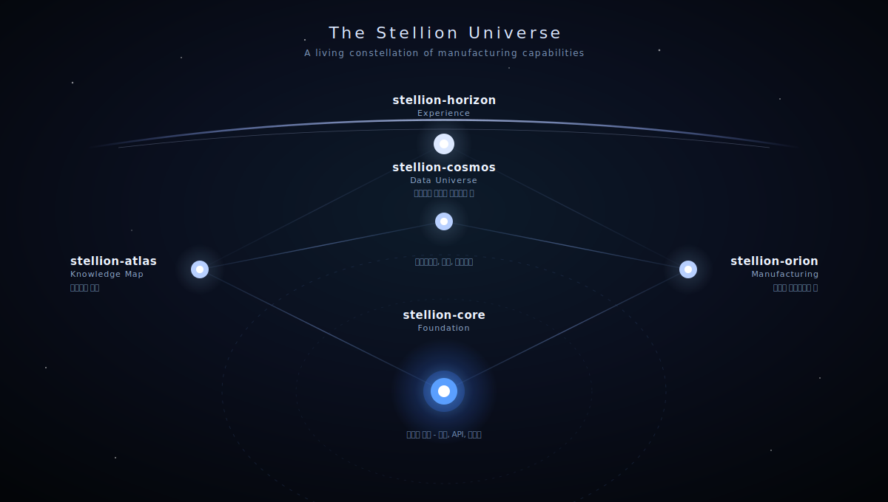

<div align="center">

# 🌌 Stellion

### Connecting Stars. Creating AX Value.

별들이 연결되어 별자리를 이루듯, 데이터·프로세스·사람·AI를 연결하여 제조 혁신의 가치를 완성하는 Digital Operation Platform




---

## ✨ About Stellion

**Stellion**은 제조 산업의 디지털 전환(DX)과 AI 전환(AX)을 위한 오픈 플랫폼 프로젝트입니다.

Stellion이라는 이름은 다음의 의미를 담고 있습니다.

> **Star + Constellation + Ion**

흩어진 별들이 연결되어 하나의 별자리가 되듯, 데이터, 프로세스, 사람, AI를 연결하여 새로운 가치를 창출합니다.

제조 현장에는 수많은 시스템과 데이터가 존재합니다.

- ERP
- MES
- EAM
- IoT
- 설비 데이터
- 품질 데이터
- 작업자 정보
- 생산 이력
- AI 분석 결과

Stellion은 이러한 개별 요소들을 하나의 운영 체계로 연결하여, 실질적인 제조 혁신을 실현하는 것을 목표로 합니다.

---

## 🎯 Vision

> Connect Everything. Optimize Operations. Accelerate AX.

Stellion은 단순한 MES 구축을 목표로 하지 않습니다.

제조 운영 전반을 연결하고, 표준화된 데이터와 프로세스를 기반으로 AI가 활용 가능한 Manufacturing Platform을 구축하는 것을 지향합니다.

이를 통해 사람과 시스템, 데이터와 프로세스가 유기적으로 연결되는 Digital Operation Ecosystem을 만들어갑니다.

---

## 🏗 Architecture

```text
Stellion
├─ stellion-core
├─ stellion-orion
├─ stellion-cosmos
├─ stellion-horizon
└─ stellion-atlas
```

---

## 🌠 Stellion Universe

각 Stellion 프로젝트는 하나의 별자리 생태계를 구성합니다.

| Project | Role | Description |
|----------|----------|----------|
| stellion-core | Foundation | 공통 플랫폼 |
| stellion-orion | Manufacturing | 제조 도메인 |
| stellion-cosmos | Data Universe | 메타데이터 및 데이터 거버넌스 |
| stellion-horizon | Experience | 사용자 경험 및 Portal |
| stellion-atlas | Knowledge Map | 문서 및 지식 허브 |

---

## 📦 Projects

### stellion-core

**Foundation Layer**

제조 솔루션 구축을 위한 공통 플랫폼입니다.

모든 도메인 서비스가 공통적으로 사용하는 핵심 기능을 제공합니다.

#### 주요 기능

- Authentication & Authorization
- User & Organization Management
- Menu Management
- Common Code Management
- Notification Service
- File Management
- Audit Log
- Workflow Engine
- Dashboard Framework
- API Standardization

#### 목표

> 제조 시스템 개발에 필요한 공통 기능을 표준화하여 생산성과 유지보수성을 향상시킨다.

---

### stellion-orion

**Manufacturing Layer**

Orion은 밤하늘을 대표하는 별자리로, Stellion의 제조 운영 영역을 상징합니다.

실제 MES/MOM/EAM 영역의 핵심 비즈니스 기능을 제공합니다.

#### Production

- 작업지시
- 생산실적
- 공정 관리
- 생산 진척 관리

#### Material

- 자재 관리
- LOT 관리
- Traceability

#### Quality

- 품질 검사
- 불량 관리
- SPC

#### Equipment

- 설비 관리
- 설비 상태 모니터링
- 예방 정비

#### Warehouse

- 입고
- 출고
- 재고 관리

#### 목표

> 제조 현장의 업무를 디지털화하고 데이터 기반 운영 체계를 구축한다.

---

### stellion-cosmos

**Data Universe Layer**

Cosmos는 별과 은하가 연결된 거대한 우주를 의미합니다.

Stellion에서 생성되는 모든 데이터 자산을 연결하고 관리하는 데이터 플랫폼입니다.

#### 제공 예정 기능

- Data Catalog
- Metadata Management
- Data Lineage
- Business Glossary
- Schema Discovery
- Data Governance

#### 활용 예정 기술

- OpenMetadata
- OpenAPI
- PostgreSQL
- Data Lineage Engine

#### 목표

> 조직의 데이터 자산을 연결하고, 누구나 데이터를 이해하고 활용할 수 있는 기반을 제공한다.

---

### stellion-horizon

**Experience Layer**

Horizon은 항해자가 바라보는 지평선을 의미하며, 사용자가 Stellion과 만나는 접점을 상징합니다.

제조 현장의 사용자들이 직접 사용하는 Portal 및 Web Application 영역입니다.

#### 제공 예정 기능

- 통합 Dashboard
- 생산 현황 조회
- 작업지시 관리
- 품질 관리
- 설비 모니터링
- Notification Center
- 사용자 Portal

#### 활용 예정 기술

- React
- TypeScript
- Design System
- Micro Frontend Architecture

#### 목표

> 복잡한 제조 데이터를 직관적이고 효율적인 사용자 경험으로 전달한다.

---

### stellion-atlas

**Knowledge Map Layer**

Atlas는 별자리를 탐험하기 위한 지도(Map)를 의미합니다.

Stellion의 기술, 아키텍처, 도메인 지식을 체계적으로 관리하는 Documentation Hub입니다.

#### 제공 내용

- Architecture Documentation
- Development Guide
- API Specification
- Data Model
- ERD
- Domain Knowledge
- Operation Policy
- Development Standards

#### 목표

> 프로젝트의 모든 지식을 연결하고 공유하는 Single Source of Truth를 구축한다.

---

## 🛠 Core Principles

### Standardization

표준화된 데이터 모델과 API를 통해 일관된 개발 경험을 제공합니다.

### Scalability

도메인 확장이 가능한 모듈형 아키텍처를 지향합니다.

### Traceability

제조 데이터의 End-to-End 추적성을 확보합니다.

### Interoperability

ERP, MES, EAM, IoT, AI 간 유연한 연계를 지원합니다.

### Knowledge Driven

문서와 지식을 프로젝트의 핵심 자산으로 관리합니다.

### AI First

AI 활용을 고려한 데이터 구조와 아키텍처를 설계합니다.

---

## 🚀 Roadmap

### Phase 1 — Foundation

- Stellion Core 구축
- 공통 모듈 개발
- API 표준 정의
- Atlas 문서 플랫폼 구축

### Phase 2 — Manufacturing

- 생산 관리 모듈
- 자재 관리 모듈
- 품질 관리 모듈

### Phase 3 — Data

- OpenMetadata 연계
- Data Catalog 구축
- Metadata Platform 구축

### Phase 4 — Experience

- Portal 구축
- Dashboard 고도화
- 제조 운영 UX 개선

### Phase 5 — AI

- AI Copilot
- Predictive Maintenance
- Production Optimization
- Manufacturing Intelligence

---

## 🌟 Philosophy

> Every Star Matters.

하나의 별은 작은 점에 불과하지만, 수많은 별들이 연결되면 별자리가 되고, 별자리는 길을 찾는 기준이 됩니다.

Stellion은 흩어진 데이터와 기술을 연결하여 제조 혁신을 위한 새로운 별자리를 만들어갑니다.

---

## 🌌 The Stellion Story

> 데이터는 Cosmos에서 연결되고,
>
> 지식은 Atlas에 기록되며,
>
> 운영은 Orion에서 수행되고,
>
> 경험은 Horizon을 통해 전달됩니다.
>
> 그리고 그 모든 기반은 Core 위에서 동작합니다.

Stellion은 각각의 기술과 도메인이 독립적으로 존재하는 것이 아니라, 하나의 별자리처럼 연결되어 더 큰 가치를 만들어내는 Digital Operation Ecosystem을 지향합니다.

---

<div align="center">

### Connecting Stars. Creating AX Value.

</div>
